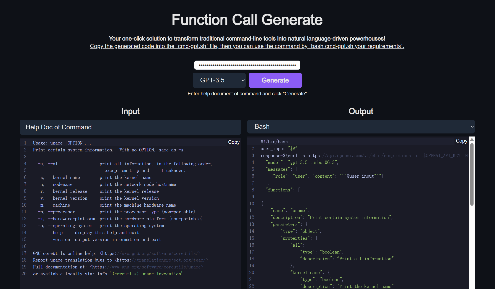

# Function Call Generate

Generate gpt function call api from commandline help info. See [function-calling](https://platform.openai.com/docs/guides/gpt/function-calling) for more detail about function call.



## Use with Website

You can visit [https://function-call-generate.vercel.app/](https://function-call-generate.vercel.app/) to use this tool online.

Paste the help document of the command to the left text box, then copy the corresponding gpt script generated in the right text box to a local file, such as `uname-gpt.sh` file, and then you can easily use the command in the following way:
```console
$bash uname-gpt.sh print the kernel information
```

## Running Locally

**1. Clone Repo**

```bash
git clone https://github.com/eunomia-bpf/ai-func-call-gen.git
```

**2. Install Dependencies**

```bash
npm i
```

**3. Run App**

```bash
npm run dev
```
